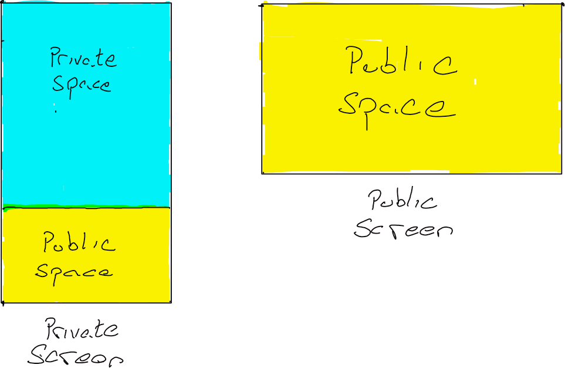
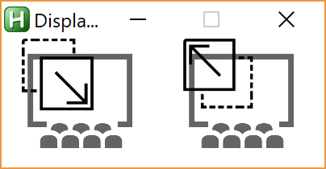

# Paperless Prof
PaperlessProf enables you to smoothly teach engineering lectures from a tablet PC. The key advantage is having a OneNote page to read as you teach, and another page that the class sees as a virtual white board. Also works with Power Point, Chrome, DrawboardPDF. 

The program splits the screen on your tablet (in portrait mode) into two areas, shown in the schematic below.
1. The **private area** that only you can see. This is where you'll keep your notes that you plan to lecture from
2. The **public area** that is mirrored onto the projector. This is where you'll have a OneNote page to use as a *virtual whiteboard* (or you can use Drawboard to draw in PDFs). 

## Usage
(**Download the latest version of `PaperlessProf.exe`**)[dist/PaperlessProf.exe]. The executable is portable and will run from any directory. (For example place in your `My Documents` folder.)
Ensure that you have (VLC Player)[https://www.videolan.org/vlc/index.html] installed.

1. Set your tablet to portrait mode
2. Connect your tablet to the classroom project, and set to extended desktop. 
3. Run `PaperlessProf.exe`. This will automatically do the following:
	a. Move the windows taskbar on the tablet from the bottom to the top of the screen. This prevents you from accidentally switching between windows when you're writing. 
	b. Automatically move all the open windows into the *private area*
	c. Create a new OneNote page and place it in the *public area*
	d. Create a new Chrome window and place it in the *public area*
	e. Move the Drawboard window into the *public area*
	f. Create a GUI window in the bottom left of the *private area*
4. Use the GUI to move switch a window from one area to another.
	a. Click the left button, then the window which you want to move from the *private area* to the *public area*
	b. Click the right button, then the window which you want to move from the *public area* to the *private area*
	
5. Close the GUI (by click the `X` in the upper right) to close the VLC mirror and return the taskbar to the bottom
		
Note: Running `PaperlessProf.exe` will create a folder named `assets` in its current directory. If you delete this folder or its contents, it will be recreated the next time you run `PaperlessProf.exe`
		
### Using with PowerPoint
PowerPoint is best for presenting powerful images and graphics, while OneNote is best for presenting hand calculations to engineering problems. `PaperlessProf.exe` allows you to leverage these two software to their full potential. 
1. Run `PaperlessProf.exe` to create the virtual whiteboard and private notes area
2. Run PowerPoint, and present using (presenter view)[https://support.office.com/en-us/article/what-is-presenter-view-98f31265-9630-41a7-a3f1-9b4736928ee3]
3. Use the windows taskbar to switch between the PowerPoint or VLC (the mirror window) displayed to the class on the projector

## Toubleshooting
 * Ensure that the desktop is (extended to the projector)[https://support.microsoft.com/en-us/help/27911/windows-10-connect-to-a-projector-or-pc]
 * Ensure that the tablet is primary monitor ((How to set the primary monitor)[https://www.windowschimp.com/how-to-set-a-display-as-the-main-display/]
 
### Known issues
 * Screen capture in VLC can be quite laggy. Expect a refresh rate of 0.5Hz to 2Hz.
	- This is the biggest issue when you need to display a video to the class. In which case, embed the video in a PowerPoint presentation and use presenter view. Click on the taskbar to switch between the PowerPoint window being on top, or the VLC window on top on the projector display. 

## Requirements

### Usage
 * (VLC Player)[https://www.videolan.org/vlc/index.html]
 
### Development
 * (AutoHotkey)[https://autohotkey.com/]
 
#### Optional requirements
 * (DrawboardPDF)[https://www.microsoft.com/en-us/store/p/drawboard-pdf/9wzdncrfhwqt?SilentAuth=1&wa=wsignin1.0]